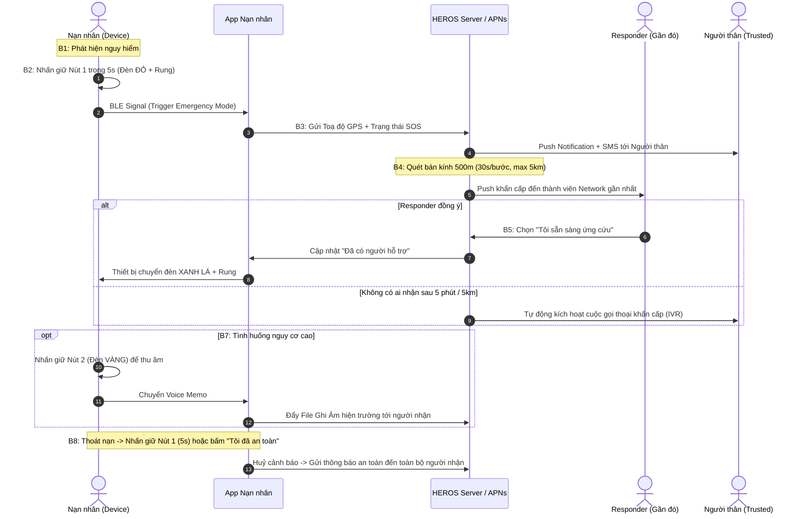

# BÁO CÁO PHÂN TÍCH & KẾ HOẠCH TRIỂN KHAI HỆ THỐNG CỨU HỘ KHẨN CẤP HEROS

> **Dự án**: HEROS - Safety With You  
> **Nền tảng**: iOS (SwiftUI + Clean Architecture) & Cloud Backend Architecture  
> **Phiên bản tài liệu**: 2.0 (Cập nhật quy trình phản ứng nhanh đa tầng)  

---

## 1. PHÂN TÍCH BẢNG MÀU & NHẬN DIỆN THƯƠNG HIỆU TỪ LOGO


### A. Ý nghĩa hình tượng Logo
1. **Biểu tượng chiếc khiên (Shield)**: Tượng trưng cho sự bảo vệ, che chở và phòng thủ vững chắc trước các nguy cơ mất an toàn.
2. **Khuôn mặt người phụ nữ & mái tóc mềm mại**: Đại diện cho đối tượng người dùng trọng tâm là phái nữ, kết hợp giữa sự nữ tính, thanh lịch và sự kiên cường, tự chủ.
3. **Chuông cảnh báo (Bell) trong chữ "O"**: Điểm nhấn chức năng cốt lõi – cảnh báo âm thanh lớn, báo động cứu nạn tức thời.
4. **Sóng phát tín hiệu (Signal Waves) trên chữ "S"**: Thể hiện kết nối thông minh không dây (BLE, GPS, Realtime Network) luôn kết nối người dùng với cộng đồng cứu hộ.
5. **Tagline "SAFETY WITH YOU" & Trái tim nhỏ**: Sứ mệnh đồng hành, mang lại cảm giác an tâm, bảo vệ bằng sự gắn kết cộng đồng và yêu thương.

### B. Bảng mã màu chuẩn (Design System Color Palette)

| Vai trò màu sắc | Mã Hex | Tên màu | Mục đích sử dụng trên UI/UX |
| :--- | :--- | :--- | :--- |
| **Primary Brand** | `#FF4D88` | Magenta Rose | Màu chủ đạo của app, Header, Logo, nút CTA chính, TabBar active. |
| **Primary Gradient** | `#FA709A` $\rightarrow$ `#F43F5E` | Rose Gradient | Dải màu gradient cho nút bấm trung tâm, Hero Card, Banner cao cấp. |
| **Emergency Red (SOS)** | `#E11D48` | Vivid Crimson | Trạng thái khẩn cấp, Đèn LED SOS, Radar Pulse, Pin bản đồ SOS. |
| **Recording Amber** | `#F59E0B` | Warning Gold | Trạng thái ghi âm hiện trường (Đèn vàng trên thiết bị & Waveform âm thanh). |
| **Responder Green** | `#10B981` | Emerald Safety | Trạng thái "Đã có người ứng cứu", Đèn LED xanh lá, Báo an toàn. |
| **Fallback Blue** | `#0284C7` | Sky Dispatch | Trạng thái tổng đài gọi khẩn cấp tự động, nút Gọi điện thoại / Chỉ đường. |
| **Background Tint** | `#FFF5F8` | Soft Rose Cream | Màu nền toàn app, nhẹ nhàng, giảm stress cho người dùng nữ. |
| **Surface Dark / Text** | `#1E1B2E` | Deep Plum Navy | Màu chữ tiêu đề chính, tạo độ tương phản cao và hiện đại. |
| **Subtext / Inactive** | `#8E8A9F` | Cool Mauve Slate | Màu chữ phụ, mô tả tính năng, icon trạng thái chưa kích hoạt. |

---

## 2. QUY TRÌNH HOẠT ĐỘNG TOÀN DIỆN 8 BƯỚC (END-TO-END FLOW)



---

## 3. THIẾT KẾ PHẦN CỨNG (HEROS HARDWARE) & TƯƠNG TÁC ĐÈN LED / RUNG

Thiết bị phần cứng gồm **2 nút bấm vật lý độc lập**:

| Nút vật lý | Thao tác | Tín hiệu trên thiết bị | Hành vi hệ thống |
| :--- | :--- | :--- | :--- |
| **Nút 1: SOS Khẩn Cấp** | **Nhấn giữ 5 giây** | • **Đèn LED sáng ĐỎ**<br>• Rung phản hồi dài | • Thiết bị chuyển sang **Emergency Mode**.<br>• App lấy GPS chính xác cao và bắn tín hiệu cứu hộ lên Server.<br>• Bắt đầu quét mạng lưới người hỗ trợ trong bán kính 500m. |
| | **Nhấn giữ 5s lần nữa** *(hoặc bấm An toàn trên App)* | • **Đèn TẮT**<br>• Rung 2 nhịp ngắn | • Xác nhận **"Tôi đã an toàn"**.<br>• Kết thúc cảnh báo, thông báo đến người thân và cứu hộ viên. |
| **Nút 2: Ghi Âm Bằng Chứng** | **Nhấn giữ (Hold to Record)** | • **Đèn LED sáng VÀNG** trong suốt lúc thu | • Micro trên thiết bị/điện thoại kích hoạt thu âm đối thoại.<br>• Thu tối đa 120s/đoạn (hỗ trợ gửi nhiều voice notes liên tiếp). |
| | **Thả tay (Release)** | • **Đèn TẮT** | • Đóng gói tệp âm thanh, tự động upload và gửi ngay đến đối tượng cài đặt. |

### 🚥 Ý nghĩa trạng thái Đèn LED & Động cơ rung trên thiết bị:
1. **Đèn ĐỎ + Rung**: Đang phát tín hiệu SOS cầu cứu, hệ thống đang quét tìm người cứu hộ.
2. **Đèn XANH LÁ + Rung**: **Đã có người xác nhận "Tôi sẵn sàng ứng cứu"** và đang trên đường đến.
3. **Đèn XANH DƯƠNG**: Không có người xung quanh ứng cứu $\rightarrow$ Hệ thống tự động chuyển sang **gọi điện thoại thoại khẩn cấp đến danh sách người thân**.
4. **Đèn VÀNG**: Đang trong quá trình ghi âm bằng chứng hiện trường.

---

## 4. THUẬT TOÁN TÌM KIẾM CỨU HỘ THEO BÁN KÍNH MỞ RỘNG (EXPANDING RADIUS ALGORITHM)

```
[SOS Kích Hoạt]
       │
       ▼
 [Bán kính 500m] ──(Sau 30s chưa có người nhận)──► [Bán kính 1.000m]
                                                           │
                                                  (Sau 30s tiếp theo)
                                                           ▼
                                                   [Bán kính 1.500m]
                                                           │
                                                          ...
                                                           ▼
 [Kích hoạt Auto-Call gọi Người thân] ◄──(Sau 5 phút)── [Bán kính Max 5.000m]
```

- **Quy tắc bước nhảy**: Bắt đầu từ bán kính **500m**, mỗi **30 giây** nếu chưa có ai bấm *"Tôi sẵn sàng ứng cứu"*, bán kính quét tự động tăng thêm **+500m** cho đến mức tối đa **5.000m (5km)**.
- **Giới hạn số lượng**: Khi đã có đủ số người ứng cứu cần thiết (ví dụ: 2-3 người xác nhận), hệ thống tự khóa nhận ca để tránh tình trạng tụ tập quá đông người gây hoảng loạn.
- **Cơ chế Fallback (Quá 5 phút / Hết 5km)**:
  - Hệ thống tự động kích hoạt tổng đài gọi điện tự động (**Automated Voice Call / Voice Chat**) lần lượt tới **SĐT 1 $\rightarrow$ SĐT 2 $\rightarrow$ SĐT 3** trong danh bạ người thân cho đến khi có người bắt máy và nghe bản thu âm khẩn cấp.

---

## 5. MA TRẬN 3 NHÓM NGƯỜI DÙNG & CƠ CHẾ BẢO VỆ CHỐNG KẺ XẤU LỢI DỤNG

| Tiêu chí | Nhóm 1: Người dùng sở hữu thiết bị HEROS | Nhóm 2: Người thân / Bạn bè | Nhóm 3: Tình nguyện viên cộng đồng / Biệt đội SOS |
| :--- | :--- | :--- | :--- |
| **Quy tắc sở hữu** | **1 Thiết bị - 1 Tài khoản - 1 Điện thoại** (Bắt buộc quét mã QR/nhập mã serial phần cứng). | Được người dùng Nhóm 1 gửi link mời cài app & ghép danh bạ. | Tải app tự nguyện vì tinh thần cộng đồng / Thành viên đội cứu trợ. |
| **Tính năng SOS** | **CÓ** (Bấm nút trên thiết bị BLE hoặc bấm trên App). | **KHÔNG** (Chỉ nhận tin báo nạn). | **KHÔNG** (Chỉ nhận yêu cầu đi cứu hộ). |
| **Mức độ xem dữ liệu** | Toàn quyền cài đặt phạm vi phát tin, danh bạ người thân, voice memo. | Xem toạ độ GPS chính xác, nghe file ghi âm, nhận cuộc gọi khẩn cấp. | **Chỉ xem toạ độ khi đã bấm "Tôi sẵn sàng ứng cứu"**. Không thấy thông tin đời tư nạn nhân. |
| **Xác minh danh tính (KYC)** | Xác minh SĐT OTP + Mã thiết bị phần cứng. | Xác minh SĐT OTP. | **Bắt buộc KYC CCCD / Định danh SĐT / Email** để ngăn chặn kẻ xấu giả danh người tốt. |

---

## 6. QUY TRÌNH XỬ LÝ CÁC BÀI TOÁN RỦI RO & BÁO ĐỘNG GIẢ

### A. Xử lý Báo Động Giả do đùa nghịch
1. **Bước 1 (Report)**: Người cứu trợ hoặc người nhận có nút *"Báo cáo sự cố giả / Đùa nghịch"* kèm lý do và hình ảnh tại hiện trường.
2. **Bước 2 (Xác minh)**: Tổng đài/chuyên viên HEROS liên hệ trực tiếp số điện thoại tài khoản kích hoạt để xác minh.
3. **Bước 3 (Chế tài)**:
   - Vi phạm lần 1: Gửi thông báo cảnh cáo và nhắc nhở chính sách.
   - **Xác nhận quá 3 lần báo động giả**: **Khóa tính năng cảnh báo SOS của tài khoản trong vòng 30 ngày**.
4. **Bước 4 (Phản hồi)**: Gửi thông báo xin lỗi và cảm ơn sự nhiệt tình của người đi cứu hộ.

### B. Xử lý trường hợp "Báo động thật nhưng đến nơi không thấy nạn nhân"
- Hệ thống gửi thông báo cập nhật lộ trình di chuyển của nạn nhân thời gian thực (Live Tracking GPS).
- Nếu nạn nhân đã tự thoát nạn và bấm *"Tôi đã an toàn"*, hệ thống lập tức thông báo để người cứu trợ dừng hành trình.

---

## 7. CẤU TRÚC GIAO DIỆN APP HEROS (SWIFTUI APP SITEMAP)

```
HEROS App (iOS SwiftUI)
├── 1. Tab Bản Đồ Cứu Hộ (Home Map)
│   ├── Radar hiển thị điểm SOS tròn nổi bật (Màu đỏ)
│   ├── Bottom Sheet thông tin chi tiết:
│   │   ├── Tên & Ảnh nạn nhân (được làm mờ bảo mật theo role)
│   │   ├── Địa chỉ realtime (Số nhà, đường, phường/xã, quận/huyện)
│   │   ├── Thời gian đã phát tín hiệu (VD: 3 phút trước)
│   │   ├── Số người đang trên đường ứng cứu ("Hiện đã có 2 người đang đến")
│   │   ├── Trình nghe file ghi âm đối thoại bằng chứng
│   │   └── Nút "Tôi sẵn sàng ứng cứu" & "Chỉ đường đến hiện trường"
│   └── Nút Báo cáo báo động giả (Report False Alarm)
│
├── 2. Tab Thiết Bị HEROS (Hardware Management)
│   ├── Trạng thái kết nối BLE (Connected / Disconnected)
│   ├── Ước tính thời lượng pin: Hiển thị % Pin + "Dự kiến còn 14 ngày sử dụng"
│   ├── Hướng dẫn minh họa 4 màu đèn LED (Đỏ: Cầu cứu, Xanh lá: Có người đến, Vàng: Ghi âm, Xanh dương: Auto Call)
│   └── Quét mã QR ghép nối thiết bị mới
│
├── 3. Tab Cài Đặt Khẩn Cấp & Danh Bạ
│   ├── Danh sách liên hệ người thân (Tên, quan hệ, SĐT, thứ tự ưu tiên Auto-Call)
│   ├── Cài đặt phạm vi gửi bản ghi âm (Người thân / Emergency Network / Cả hai)
│   └── Điều khoản bảo mật & Tuyên bố miễn trừ trách nhiệm pháp lý (Disclaimer)
│
└── 4. Tab Cẩm Nang Phái Đẹp (Women's Safety & Care Hub)
    ├── Kỹ năng tự vệ & thoát hiểm trong không gian hẹp / ban đêm
    ├── Hướng dẫn nhận diện đối tượng theo dõi / lừa đảo
    └── Kiến thức dinh dưỡng & chăm sóc sức khỏe phụ nữ
```

---

## 8. KẾ HOẠCH BƯỚC TIẾP THEO (ACTION PLAN CHO DEV TEAM)

1. **Cập nhật Theme & Asset Catalog**: Thay thế bảng màu cũ sang hệ mã màu **Magenta Rose & Pastel Pink** của thương hiệu HEROS.
2. **Triển khai Mô hình thuật toán mở rộng bán kính (500m $\rightarrow$ 5km)** trong `SOSService`.
3. **Mở rộng Mock UI cho Tab "Cẩm Nang Phái Đẹp"** và **Module "Báo cáo báo động giả"**.
4. **Tích hợp mô phỏng cuộc gọi tự động (Fallback Auto-Call IVR)** khi không có người tiếp nhận sau 5 phút.
